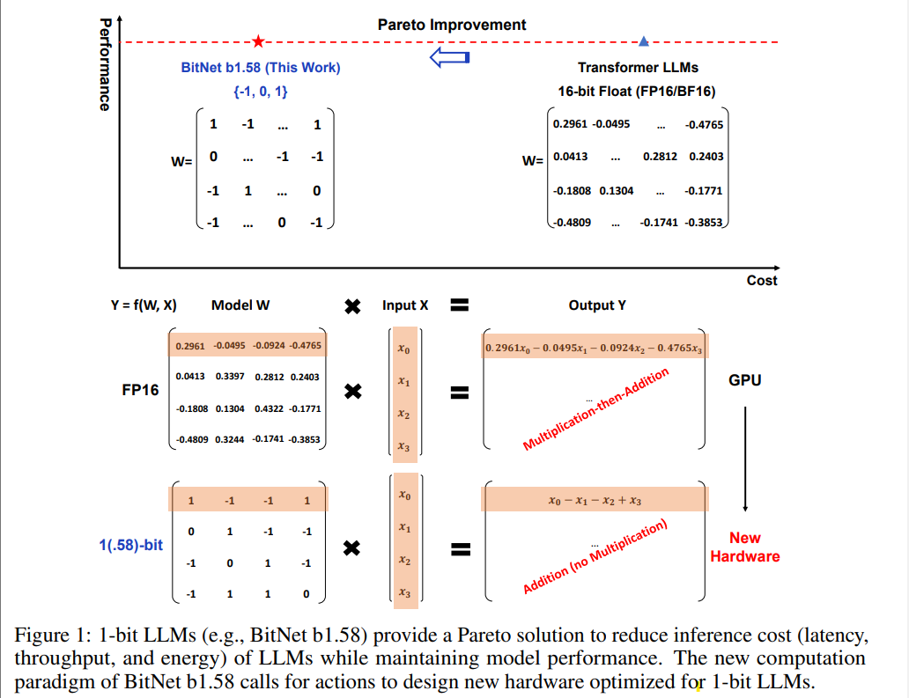

### EraOf1ibtLLMs
  

## Title : The Era of 1-bit LLMs: All Large Language Models are in 1.58 Bits
> **Journal/Coference** :    
> **Year** : 2024   
> **Author** : Microsoft 
> **Label / Tag** :  
> **Url** : https://arxiv.org/pdf/2402.17764.pdf   
> **Github** :

 
 

 
**About** :

- 1.58비트 LLM을 출시, 행렬 계산을 더하여 계산 비용 급감
- 모델의 가중치를 [-1, 0, 1] 세가지 값만 사용, 곱셈없이 더하기만으로 LLM 계산 비용 급감
- 

 

 
**ETC** :
- 

  

